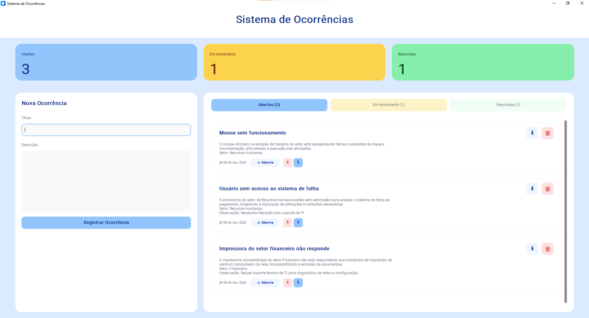
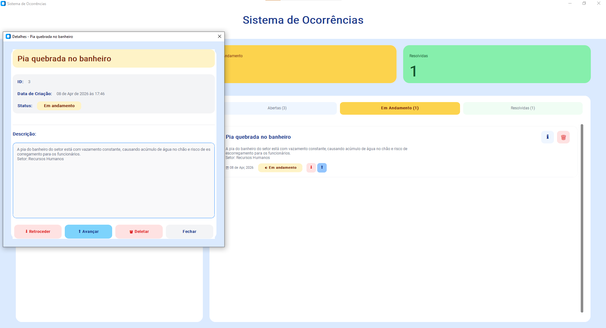

# 🏢 Sistema de Registro de Ocorrências Internas


## 📌 Descrição do Problema
Em ambientes corporativos, é comum que problemas internos (como falhas de TI, manutenção, demandas operacionais) sejam registrados de forma desorganizada, muitas vezes em mensagens informais ou sem acompanhamento adequado. Isso pode gerar perda de informações, falta de priorização e dificuldade no controle das demandas.

---

## 💡 Proposta da Solução
Este projeto propõe um sistema simples de registro de ocorrências internas, permitindo cadastrar, visualizar e acompanhar o status de problemas dentro de uma organização. A aplicação simula um sistema de help desk utilizado em empresas, organizando as demandas de forma estruturada.

O projeto pode ser usado de duas formas:
- **CLI**: interface em linha de comando para operações rápidas
- **GUI**: interface gráfica com CustomTkinter para uma experiência visual mais amigável

---

## 🎯 Público-Alvo
- Pequenas empresas
- Equipes internas (TI, manutenção, RH)
- Pessoas que desejam organizar demandas internas de forma simples

---

## ⚙️ Funcionalidades Principais
- **CLI**
	- Criar ocorrências
	- Listar ocorrências cadastradas de forma resumida
	- Atualizar status das ocorrências (aberta, em andamento, resolvida)
	- Ver detalhes completos de uma ocorrência
	- Excluir ocorrências
    - Persistir os dados automaticamente em arquivo JSON

- **GUI**
	- Criar ocorrências pelo formulário lateral
	- Visualizar ocorrências em cards organizados por status
	- Ver detalhes de uma ocorrência em uma janela dedicada
	- Atualizar o status para frente ou para trás
	- Excluir ocorrências
    - Persistir os dados automaticamente em arquivo JSON 

---

## 🛠️ Tecnologias Utilizadas
- Python 3
- CustomTkinter
- Pytest (testes automatizados)
- Ruff (linting/análise estática)
- Git e GitHub

---

## 🖼️ Interface do Sistema

### Tela principal


### Detalhes da ocorrência


---

## 📦 Instalação

Antes de começar, você precisa ter:

- Python 3 instalado (recomendado: 3.10 ou superior)
- Uma IDE ou editor de código (VS Code, PyCharm ou similar)

---

### 1. Baixe o projeto

Clone o repositório:

```bash
git clone https://github.com/Annans95/Sistema-Ocorrencias.git
cd Sistema-Ocorrencias
```
Ou baixe o ZIP diretamente pelo GitHub e extraia os arquivos.

### 2. Instale as dependências
Abra o terminal na pasta do projeto e execute:
```bash
pip install -r requirements.txt
```
💡 Dica: Você pode criar um ambiente virtual para isolar as dependências do projeto:

```bash
python -m venv venv

#Windows
venv\Scripts\activate 
#Linux/Mac
source venv/bin/activate
```
---

## ▶️ Execução
Após instalar as dependências, você pode usar o sistema de duas formas:

### CLI (linha de comando)
```bash
python src/main.py
```

### GUI (interface gráfica)
```bash
python src/ui/app.py
```

As duas interfaces usam o mesmo arquivo de persistência: `ocorrencias.json` na raiz do projeto.
Ou seja, uma ocorrência criada pela CLI aparece na GUI (e vice-versa).

---

## 🧪 Testes Automatizados
Para executar os testes:
```bash
pytest
```
---

## 🧹 Lint (Análise Estática)
Para verificar a qualidade do código:
```bash
ruff check .
```
Lint executado utilizando Ruff.
Resultado: nenhum problema encontrado (all checks passed).

---

## 🔢 Versionamento
Versão atual: 1.0.0

---

## 👩‍💻 Autora
Anna Nicolly da Silva

---

🔗 Repositório: [Sistema de Ocorrências](https://github.com/Annans95/Sistema-Ocorrencias)
